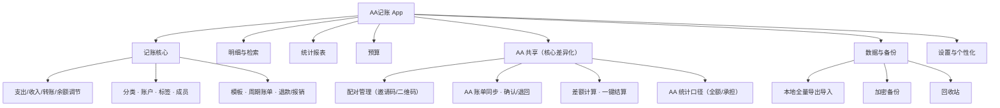
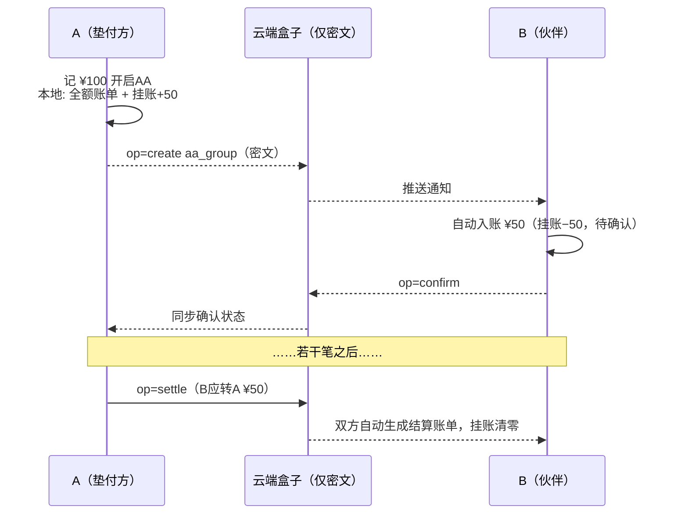
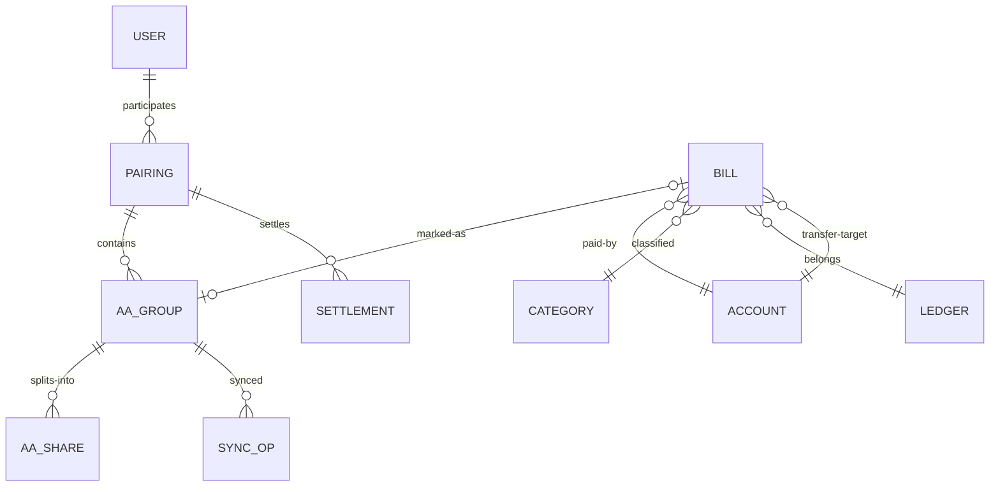

# AAExpenseSplitter · AA 记账 App 功能设计框架

| 项 | 内容 |
|---|---|
| 文档版本 | v0.2（M1/M2 原型已实现，含无服务器同步与图片识别） |
| 日期 | 2026-10-05 |
| 产品形态 | 移动 App（iOS / Android），离线优先 |
| 对标产品 | 钱迹（基础记账）+ 自研 AA 共享账本能力 |

---

## 1. 产品概述

### 1.1 一句话定位

一款**离线优先的个人记账 App**（基础体验对标钱迹），在此之上提供 **AA 共享账本**能力：被标记为 AA（两人平分）的支出，会自动同步到另一半的账本，双方各自看到自己应承担的份额，并随时知道**"谁欠谁多少、一键结算"**。

### 1.2 目标用户

- **核心**：共同生活、日常开销平分的情侣 / 夫妻（一对一关系）。
- **延伸（V2）**：合租室友、小型家庭多人分摊。
- **兜底**：单人用户可当纯本地记账工具使用，AA 功能零打扰（不配对即不出现）。

### 1.3 设计原则

1. **离线优先**：本地数据库是唯一事实来源，无网、无账号时全功能可用（学钱迹）。
2. **数据归属用户**：只有被标记为 AA 的账单才会（加密后）离开设备，其余数据永不上云。
3. **3 秒记账**：大键盘 + 常用分类，AA 只增加一个开关。
4. **口径清晰**：每一笔 AA 账单的"总额 / 双方份额 / 垫付人 / 差额 / 结算"全程可追溯。

### 1.4 与钱迹的功能对照

| 能力 | 钱迹 | 本产品 |
|---|---|---|
| 支出 / 收入 / 转账 / 余额调节 | ✅ | ✅ 继承 |
| 一二级分类、自定义分类、不计收支 | ✅ | ✅ 继承 |
| 多账户、净资产、信用卡 | ✅ | ✅ 继承 |
| 明细流、筛选、搜索 | ✅ | ✅ 继承 |
| 统计图表（分类/账户/趋势） | ✅ | ✅ 继承，并新增 **AA 维度与承担口径** |
| 预算、周期账单、报销、退款 | ✅ | ✅ 继承（部分放 V2） |
| 数据导出、导入支付宝/微信、WebDAV 备份 | ✅ | ✅ 继承（导入放 V2） |
| 账单云同步 | ❌（定位本地） | ⚠️ **仅 AA 账单**加密同步 |
| AA 分账 / 共享账本 / 差额结算 | ❌ | ✅ **核心差异** |

---

## 2. 功能架构总览



---

## 3. 基础记账模块（对标钱迹）

> 目标：单机体验不弱于钱迹。AA 能力作为记账页的一个开关叠加，不破坏原有流程。

### 3.1 记一笔

- **账单类型**：支出 / 收入 / 转账 / 余额调节（金额改正，不算收支）。
- **快速记账**（已按钱迹布局实现）：顶部 支出/收入/转账 页签；**5 列分类宫格**（选中高亮）；底部面板 = 备注（记录消费地点/明细）+ **大金额 CNY**（支持 +− 连算）+ 属性胶囊行（账户 / AA平分开关 / 日期时间，横向滚动）+ 计算键盘（长按⌫清空，绿色保存键）；账户胶囊下方实时显示余额变化提示。
- **防重复入账**：保存时自动检查**同类型 + 同金额 + 同一天**的相似账单，存在时弹窗列出已有账单并要求确认（「取消 / 仍要保存」）后才入账——防图片识别重复保存、误触双击等场景；编辑已有账单时排除自身。
- **字段**：金额、一级/二级分类、账户、日期时间（支持补记/改期）、备注（记录消费地点/明细）、标签、成员、报销标记、图片附件、**AA 标记（本产品新增，见 §4）**、**图片识别入口（见 §3.8）**。
- **模板与周期账单**：固定支出（房租、订阅）按周期自动生成待确认账单（V2）。
- **退款**：对已有账单标记全额/部分退款，冲减原分类统计。

### 3.2 分类体系

- 预置一级分类（餐饮、购物、日用、交通、居住、娱乐、医疗、教育、人情、宠物、通讯…），每类下预置二级分类。
- **自定义分类（已实现）**：「我的 → 分类管理」，按 支出/收入/不计收支 分组管理；新增/改名/换图标（内置 48 个常用图标库）、长按拖动排序；仍有账单关联的分类禁止删除（提示改名继续用）；记账宫格末尾提供「⚙️ 管理」快捷入口；二级分类与"不计收支"分类的完整支持见 V2 规划。
- 分类的增删改仅作用于本地，不参与同步（AA 同步时仅同步分类的**名称快照**用于展示）。

### 3.3 账户体系

- 预置：现金、微信、支付宝、储蓄卡、信用卡、公交卡…；可自定义。
- 账户属性：名称、图标、期初余额、是否计入净资产、排序；信用卡支持账单日/还款日（V2）。
- 账户间转账：用于取现、还信用卡核销。
- **资产页**：净资产总览、各账户余额与趋势。
- **新增账户类型：`AA 挂账`（虚拟账户）**——配对后自动创建，专用于承接 AA 份额，见 §4.4。

### 3.4 明细页（首页 Tab 1）

- 按月切换；按日分组，含日小计；月头部显示当月收入/支出/结余。
- AA 账单在列表中有专属角标（如 "AA"），点击进详情可看双方份额。
- 筛选：分类、账户、成员、标签、**AA 状态**、报销状态、金额区间。
- 搜索：备注关键词 + 金额 + 组合条件。
- 账单详情：全部字段展示，操作：修改 / 删除 / 复制 / 退款 / 转为 AA（或取消 AA）。

### 3.5 统计图表（Tab 2）

- 周期：周 / 月 / 年 + 自定义区间。
- 维度：分类（饼图+排行）、账户、成员、标签、收支趋势（折线/柱）、同比环比。
- **本产品新增两种口径（可切换）**：
  - **全额口径**：按账单实际金额统计（资金流视角）。
  - **承担口径**：AA 账单按本人份额折算（消费观视角，例：垫付 ¥100 的 AA 晚餐只计 ¥50）。
- **AA 维度报表**（放入 AA Tab，见 §4）：双方各自承担、互相垫付、结算历史。

### 3.6 预算

- 月总预算 / 分类预算，进度条 + 超支提醒（本地通知）。
- 预算口径跟随统计口径设置（全额 or 承担）。
- AA 共享预算（两人合计口径，V2）。

### 3.7 数据与备份

- 本地全量导出 / 导入（Excel / CSV）。
- 加密备份到本地文件或 WebDAV。
- 支付宝 / 微信账单 CSV 导入（V2）。
- 回收站：删除账单软删除 30 天，可恢复。

### 3.8 图片识别记账（对标钱迹"拍照记账"，已实现原型）

用相机拍小票/账单或从相册选择，自动识别金额与商户并填入记账表单。

**设计原则：**

1. **本地识别**：ML Kit 端上中文 OCR，离线可用，图片不离开设备（与"最小上传"隐私原则一致）。
2. **机器提取、人工确认（识别结果可修改）**：识别结果面板是一张**可编辑表单**，五个字段均可修改——金额（手输 + 候选一键填入）、日期（点选日期选择器）、备注（文本编辑）、账户/分类（点选弹层更换）；"采用并填入"以面板中的最终内容为准，未识别出金额时也可手动补录。

   默认识别策略：
   - **金额**：多候选点选（纯金额行如「-2.00」优先，其次 ¥/元 标记，再退化为无标记小数）；
   - **备注**：商户 + 路线/区间（如「厦门地铁 湖滨东路→莲坂」）；
   - **账户**：解析「付款方式」行，按关键词（储蓄卡/银行 → 银行卡类账户、微信/零钱、支付宝/余额、现金）与账户名匹配本地账户，未匹配则保持当前选择；
   - **日期时间**：从「支付时间 2026-10-04 10:43:41」等行解析；
   - **分类猜测**：关键词映射（地铁/公交→交通、外卖/火锅→餐饮、超市→购物等），供参考。
3. **规则解析管线——「平台模板优先、通用规则兜底」的分层架构**（`lib/recognition/bill_ocr.dart`）：先用签名词检测账单来源（微信：支付成功/收单机构/财付通/当前状态；支付宝：账单详情/查看扣款顺序/收款方全称），命中后由平台模板做针对性修正——如微信商户名取「大字金额行的下一行」，且候选必须通过**纯中文严格校验**（ML Kit 行切分偶有波动，锚点可能读到干扰行），不合格即回退通用启发；未命中任何模板（纸质小票、其他 App）走通用规则。模板注册表（`BillTemplate`）便于后续接入美团/抖音（待真实样张校准）。通用层各字段策略：
   - 金额提取：纯金额行（带小数点的整行数字，如支付截图大字「-2.00」）优先 → ¥/￥/元 标记 → 无标记小数；剔除日期/电话/订单号/电量等干扰行；结果降序去重，过滤 0~100 万之外的异常值。
   - 商户/路线：在合格短行（2~20 字、含中文、排除界面词与支付关键词）中，**优先取出现次数最多的纯中文行**——支付账单里商户名通常重复出现（顶部 + 金额下方），可避开状态栏时间、按钮文字等一次性干扰行；平票取最早。含「→」的行识别为路线/区间，与商户拼成备注建议。
   - 结构化字段：付款方式行（账户匹配依据）、支付时间（日期时间，兼容「2026-10-04 10:43」与「2026年10月04日 21:18」两种格式）。
4. **失败兜底**：未识别到金额时提示重拍，不阻塞手工记账。
5. **扩展预留（V2）**：接入 LLM 云端识别（结构化出分类/日期/明细）、发票抬头识别、微信/支付宝账单截图专用模板。

---

## 4. AA 共享模块（核心差异化）

### 4.1 概念与术语

| 术语 | 定义 |
|---|---|
| 伙伴 Partner | 配对的另一位用户（V1 一对一） |
| AA 账单 | `is_aa = true` 的**支出**账单；V1 固定两人平分（各 50%） |
| 垫付人 Payer | 实际付钱的一方 |
| 份额 Share | 各方承担的金额（V1 = 总额 × 50%） |
| AA 挂账 | 双方账本中的虚拟账户，承接 AA 份额与结算核销 |
| 差额 Balance | 未结算 AA 账单累计后，一方应转给另一方的净额 |
| 结算 Settlement | 一方向另一方实际转账，使差额归零并留档 |

### 4.2 配对流程

1. 「我的 → AA 伙伴」→ 生成**邀请码 / 二维码**（10 分钟有效，一次性）。
2. 对方扫码或输入邀请码 → 双方各自确认（展示对方昵称，可改名备注）。
3. 配对成功时完成**共享密钥协商**（ECDH），后续同步数据端到端加密。
4. 双方账本自动创建各自独立的 `AA 挂账` 虚拟账户。

**解绑**：任一方可解绑，需对方二次确认或 7 天静默期后生效；解绑后历史 AA 账单保留只读、差额快照存档、云端数据按保留期删除。
**换绑**：V1 仅一对一；数据结构按 `pairing` 表设计，天然支持 V2 多成员组。

### 4.3 记一笔 AA 账单（主流程）

**发起方（垫付方）视角：**

1. 记账页勾选「AA」开关（可设置默认开/关；长按保存 = AA 保存）。
2. 分摊方式默认"两人平分"，实时预览"我 ¥50 / 伙伴 ¥50"。
3. 保存 → 本地立即生成：
   - 支出账单一条：金额 = **全额**，账户 = 实际支付账户；
   - AA 分摊记录：`aa_group`（总额、双方份额、状态）；
   - 挂账：`AA 挂账` 账户 **+我的应收**（= 伙伴份额）。
4. 同步引擎在后台将加密 op 推送到云端盒子；toast 提示「已同步 / 待网络同步」。

**接收方视角：**

5. 收到推送：「小明记了一笔 AA 支出 ¥100，你的份额 ¥50」。
6. **自动入账**（默认，降低摩擦）：本地生成关联账单一条——金额 = ¥50（份额）、分类/备注/时间与原账单一致、账户 = 接收方预设的默认账户（推荐 `AA 挂账`），状态 = `待确认`。
7. 接收方可操作：
   - **确认**：状态转 `已确认`（也可在设置中改为"自动确认"，跳过此步）；
   - **退回**：附一句理由，退回给发起方；
   - **修改我的入账账户** / 补充仅自己可见的私有备注。

**退回处理**：发起方收到通知后可 ① 改金额/分类后重新发起（需再确认）② 取消 AA 转普通账单 ③ 删除。

### 4.4 双方账本呈现规则（关键设计决策）

以「A 垫付 ¥100 的 AA 晚餐，各承担 ¥50」为例：

| 视角 | A（垫付方） | B（伙伴） |
|---|---|---|
| 账单金额 | **¥100（全额）** | **¥50（份额）** |
| 账户变动 | 实际支付账户 −100 | 默认 `AA 挂账` −50（**不动真实账户**） |
| 挂账余额 | AA挂账 +50（应收） | AA挂账 −50（应付） |
| 全额口径统计 | 支出 100 | 支出 50 |
| 承担口径统计 | 支出 50 | 支出 50 |
| 账单标记 | 「我垫付」 | 「来自伙伴」 |

设计要点：

- **为什么用"AA 挂账"虚拟账户**：① 对方的份额不直接污染真实账户余额；② 差额恒等于双方挂账余额之差，随时可读；③ 结算时自动核销。高级用户可把默认入账账户改为真实账户（如"微信"），表示"这笔我迟早要转"。
- **为什么发起方记全额**：符合真实资金流；承担口径的统计切换负责呈现"消费观"。
- 分类、图标为**发起方的本地分类名称快照**，接收方本地若无此分类仅作展示文本，不强建分类。

### 4.5 差额与结算

**差额公式**（自上次结算以来的未结算 AA 账单）：

```
A 的净应收 = Σ(垫付人为A的账单: 总额 − A份额) − Σ(垫付人为B的账单: 总额 − B份额)
       50/50 时 = Σ(垫付人为A: 总额/2) − Σ(垫付人为B: 总额/2)
若 A 的净应收 > 0 → 显示「B 应转给 A ¥xx.xx」，反之亦然；=0 → 已两清
```

**一键结算流程：**

1. AA 页顶部差额卡片「去结算」→ 展示计算依据明细（逐笔：日期 / 垫付人 / 总额 / 双方份额）。
2. 填写实际转账方式（微信 / 支付宝 / 现金 / 其他）与备注 → 确认「已完成转账」。
3. 生成 `settlement` 记录，双方账本自动记账：
   - 转出方：真实账户 −X，同时 `AA 挂账` +X（清回应付）；
   - 收款方：真实账户 +X，同时 `AA 挂账` −X（核销应收）。
4. 差额归零，本批 AA 账单状态转 `已结算`，新周期开始。
5. 支持部分结算与手动差额校正单（修正历史记错）。
6. 结算历史列表：金额、方向、方式、时间、覆盖的账单数。

### 4.6 编辑 / 删除 / 冲突规则

| 操作 | 发起方（Owner） | 接收方 |
|---|---|---|
| 改金额 / 比例 | 允许 → 推送新版本，**接收方需重新确认** | 不允许，只能退回建议修改 |
| 改分类 / 时间 / 备注 | 允许 → 自动同步覆盖 | 不允许 |
| 改自己入账账户 / 私有备注 | —（私有字段） | 允许，**不同步** |
| 删除 AA 账单 | 删除 → 双方同步软删除（含接收方关联账单） | 只能「仅对我隐藏」（私有，不影响对方） |
| 取消 AA 标记 | 转普通账单 → 接收方关联账单同步删除 | — |

**冲突解决**：核心字段采用**单写者原则**（Owner 写者优先，LWW）；私有字段天然无冲突；状态机冲突（如同时确认与退回）按服务器时间顺序重放，非法状态转移丢弃并提示双方。

### 4.7 通知与提醒

- 系统推送：新 AA 账单、待确认超 24h 提醒、退回、金额变更、结算邀请、结算完成。
- AA 周报（可选）：本周双方承担、垫付、当前差额。

---

## 5. 同步机制设计

### 5.1 原则

1. **离线优先**：本地 SQLite 为唯一事实来源，同步只是后台增量收发。
2. **最小上传**：仅 AA 相关数据（aa_group 元数据 + 操作日志）加密上云；普通账单、分类、账户**永不**离开设备。
3. **幂等可追溯**：每条操作有全局 `op_id`，重放不产生副作用。

### 5.2 架构

```mermaid
flowchart LR
    subgraph A["设备 A（发起方）"]
        A1[本地 SQLite] --> A2[SyncEngine<br/>OpLog + 加密]
    end
    subgraph S["云端盒子（零知识）"]
        S1[(inbox：<br/>仅密文 KV)]
    end
    subgraph B["设备 B（伙伴）"]
        B2[SyncEngine<br/>解密 + 重放] --> B1[本地 SQLite]
    end
    A2 --"AES-GCM 密文 op"| S1
    S1 --"拉取/推送通知"| B2
```

### 5.3 同步协议（OpLog）

- **同步实体**：AA 分摊记录（aa_group）、确认/退回状态、结算记录、伙伴公开资料（昵称/头像密文）。
- **Op 结构**：`op_id (uuid) / pairing_id / device_id / seq / entity_type / entity_id / action(create·update·delete·confirm·return·settle) / enc_payload / server_ts`。
- 拉取：按 pairing 游标增量拉取；推送：批量 + 指数退避重试；断网期间本地排队不丢。
- 时序：以**服务器时间**为排序基准，客户端时间仅作展示。
- 本地↔全局 ID 映射表：本地 `bill.id` 与全局 `aa_group.uuid` 映射，防重放重复入账。

### 5.4 时序示例：一笔 AA 账单的一生



### 5.5 隐私与加密

- 配对时 ECDH (P-256) 协商共享密钥 → 派生 AES-256-GCM 会话密钥；服务器只见密文（零知识）。
- 服务器不落任何明文个人信息；注销/解绑后云端数据按保留期（如 30 天）删除。
- **无云模式（已落地）**：导出 `.aas` 加密文件互传（微信/QQ发送），或「保存到指定位置」存到下载等公共目录；**导入支持三种方式**：① 文件管理器/微信聊天中直接点开 `.aas` 文件 →「用 AA记账 打开」自动导入（已注册 VIEW intent-filter，content:// 由原生层拷贝至缓存并按 DISPLAY_NAME 过滤，冷启动与运行中均可接收）；② AA 页「导入伙伴文件」经系统选择器选取；③ 后续云版本上线后在线收发。

### 5.6 服务端形态（建议）

| 方案 | 说明 | 适用 |
|---|---|---|
| Supabase / LeanCloud 等 BaaS | Postgres + Realtime，两张表（pairing、inbox）即可 | **首选**，成本近零 |
| Cloudflare Workers + KV/D1 | 边缘 KV 转发密文 | 免运维 |
| 自建 Go/Node 轻服务 | 完全可控 | 有运维意愿时 |

单 pairing 数据量为 KB 级/月，免费额度足够。

---

## 6. 数据模型（核心实体）



### 6.1 本地表（SQLite）

**bill 账单**

| 字段 | 类型 | 说明 |
|---|---|---|
| id | uuid | 本地唯一 |
| type | text | expense / income / transfer / adjust |
| amount | decimal | 金额（分为单位存储） |
| category_id | uuid | 分类 |
| account_id / to_account_id | uuid | 账户 / 转账对手账户 |
| date_time | int | 账单时间（支持补记） |
| note / tags / member / reimbursable | — | 备注/标签/成员/报销 |
| is_aa | bool | AA 标记 |
| aa_group_id | uuid? | 关联全局 AA 分摊组 |
| created_at / updated_at / deleted_at | int | 软删除 |

**其余本地表**：`ledger`（账本）、`account`（账户，type 含 **aa_credit**）、`category`（一二级，kind 含不计收支）、`tag`、`budget`、`template`（周期/模板）、`recycle`（回收站）。

### 6.2 共享实体（参与同步）

**aa_group（AA 分摊组，全局）**

| 字段 | 说明 |
|---|---|
| id | 全局 uuid（同步主键） |
| pairing_id | 所属配对关系 |
| owner_user / payer_user | 记录归属者 / 实际垫付人 |
| total_amount / ratio_owner / ratio_partner | 总额 / 分摊比例（V1 恒 0.5/0.5） |
| snapshot | 分类名、备注、时间等展示快照（密文） |
| status | pending → confirmed / returned / void；结算后 + settled |
| version / updated_at | 乐观锁版本 |

**aa_share（各方份额落地）**：aa_group_id、user、share_amount、mapped_bill_id（该方账本中落地账单的本地 id）、confirm_state。

**settlement（结算）**：id、pairing_id、amount、direction、method、note、created_at、covered_aa_ids。

**sync_op（操作日志）**：见 §5.3。

**pairing（配对关系）**：id、user_a、user_b、shared_key（各自设备各自持有）、status、created_at、dissolved_at。

---

## 7. 信息架构与关键页面

底部五 Tab：**明细 · 图表 · ➕记账 · AA · 我的**。

### 7.1 记账页（含 AA 开关）

```
┌──────────────────────────────┐
│  支出   收入   转账   余额      │
│                              │
│   ¥ 128.00                   │
│ ┌──────────────────────────┐ │
│ │ 备注: 周末超市采购          │ │
│ └──────────────────────────┘ │
│ 餐饮 ▾  晚餐     今天 18:32 ▾ │
│ 账户: 微信支付 ▾              │
│ ════════════════════════════ │
│ [AA ●]  与小王平分 → 我¥64/她¥64│  ← 开关高亮，可改比例(V2)
│ ════════════════════════════ │
│ 标签+  报销+  图片+            │
│      [ 再记一笔 ]  [ 保存 ]   │
└──────────────────────────────┘
```

### 7.2 AA 页（Tab 4）

```
┌──────────────────────────────┐
│  AA 共享             本月 ▾   │
│ ┌──────────────────────────┐ │
│ │ 小王 应转给你              │ │
│ │ ¥ 137.50                 │ │
│ │ 基于 12 笔未结算 AA 账单    │ │
│ │            [明细] [去结算] │ │
│ └──────────────────────────┘ │
│ 待你确认 (1)                  │
│ ┌ 小王 · 今天 19:02          │ │
│ │ 晚餐 ¥100 → 你的份额 ¥50   │ │
│ │        [确认]  [退回]      │ │
│ └──────────────────────────┘ │
│ 本周期 AA 账单 (12)           │
│  10-05 小王垫付 晚餐 ¥100 各50 │
│  10-04 你垫付   打车 ¥36  各18 │
│  10-03 你垫付   房租 ¥2000各1k │
│           ⋯                  │
└──────────────────────────────┘
```

### 7.3 其余关键页面

- **配对页**：生成/扫描邀请码、伙伴备注名、默认入账账户设置、AA 开关默认值、自动确认开关、解绑入口。
- **结算弹层**：差额与逐笔依据、转账方式选择、确认完成转账。
- **账单详情（AA 态）**：双方份额、垫付人、状态流转记录、挂账影响。
- **我的**：账户与资产、分类管理、预算、备份与导出、回收站、外观（深色/主题）、关于。

---

## 8. 技术架构建议

| 层 | 建议 | 备注 |
|---|---|---|
| 客户端 | Flutter | 跨平台、离线友好；状态管理 Riverpod |
| 本地存储 | drift (SQLite) 或 Isar | 金额以 int 分存储，避免浮点误差 |
| 图表 | fl_chart | |
| 加密 | ECDH P-256 + AES-256-GCM | `cryptography` 包 |
| 服务端 | Supabase（PG + Realtime） | 零知识盒子，两张表即可 |
| 推送 | FCM / APNs（国内叠加厂商通道） | 无推送时降级为轮询 |
| 同步引擎 | 独立模块 + 单元测试矩阵 | 离线排队 / 重放 / 冲突 / 半成功 |

**重点测试矩阵**：双端离线互记 → 联网合并；确认与退回并发；金额变更后重新确认；结算与退回并发；解绑后的数据隔离。

---

## 9. 非功能需求

- **性能**：保存账单 < 100ms；10 万条账单列表滚动 60fps；联网时单条同步端到端 < 2s。
- **可靠性**：同步失败本地排队永不丢数据；启动时自动对账（挂账余额 vs 未结算明细）。
- **隐私合规**：个人信息最小化；隐私政策明示"仅 AA 数据加密上传"；注销即删云端。
- **平台**：iOS / Android；后续可评估桌面端只读查看（V2）。

---

## 10. 版本规划

| 里程碑 | 范围 |
|---|---|
| **M1 · 本地 MVP** | 完整单机记账（§3 全部核心）：记账、分类、账户、明细、统计、预算基础、导出；AA 仅本地标记与差额计算（无同步） |
| **M2 · 配对与同步** | 邀请码配对、E2E 加密同步、自动入账、确认/退回、AA 页（已落地为**无服务器文件互传**方案：配对口令 + `.aas` 加密文件经微信/QQ 交换；接入云服务器时协议不变）；图片识别记账（已落地） |
| **M3 · 结算与体验** | 一键结算、通知、统计双口径、结算历史 |
| **V2 · 扩展** | 自定义分摊比例、多成员组、支付宝/微信账单导入、周期账单、多币种、局域网直连同步、AA 共享预算 |

---

## 11. 开放问题（需评审拍板）

1. **接收方入账方式**：默认"自动入账 + 可退回"（推荐，低摩擦）还是"手动确认后才入账"？（建议做成设置项，默认前者）
2. **统计默认口径**：全额 or 承担口径？（建议：明细/资产用全额，图表默认承担口径，可一键切换）
3. **账号体系**：无账号纯配对码（推荐，隐私最优）还是手机号/微信登录（便于换机恢复）？——折中：配对码 + 端侧加密备份文件恢复。
4. **结算在账本中的落账形式**：记"转账"还是"余额调节"？（建议：真实账户间转账语义，挂账核销）
5. **金额变更是否允许**：是否干脆禁止改金额、只允许"删旧重记"以简化冲突？（M2 先做需重确认的变更流程，视复杂度调整）
6. 退回的极限场景（已结算的账单被退回）如何回滚差额？
